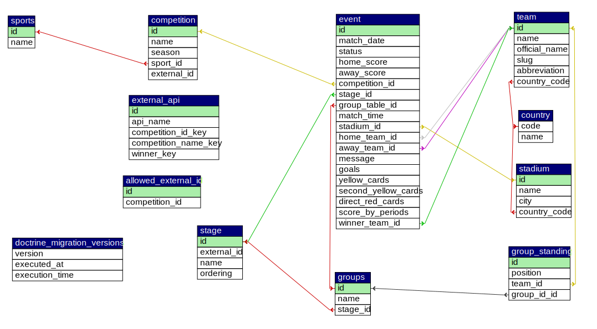

## Database Structure

### ER Diagram

---

### Database Structure Overview  
The database is designed to separate **core domain data, reference data, and external API integration logic.** This approach ensures scalability, data integrity, and flexibility when working with multiple external data providers.  

---

### 1. Core (Main) Tables
These tables represent the primary business entities of the system and are used in the application logic.

### - competition   
- Stores competitions used in the system
- Connected with `Event`
- Uses a single internal `external_id` as a stable identifier

### - event
- Represents matches or scheduled events
- Connected with `Competition`, `Team`, `Stage`, `Groups`, `Stadium`
- Contains both structured data and JSON-based statistics

### - team
- Stores team information
- Connected with `Event` (home/away)
- Uses `slug` as a stable internal identifier

### - stage
- Defines competition phases (e.g., group stage, playoffs)
- Connected with `Event` and `Groups`
- Used to organize tournament structure

### - groups
- Represents groups within a stage
- Connected with `Stage` and `Event`
- Optional (not all competitions use groups)

---

### 2. Mapping / Integration Tables

### - external_api
- Stores external identifiers from different APIs
- Does not store full API responses, only key identification data
- No direct relations with core tables
- Supports API validation and mapping logic

### - allowed_external_id
- Stores allowed external identifiers
- Used to validate incoming API data
- Ensures only trusted IDs are processed
  
---

### 3. Reference Tables

### - sports
- Defines sport types
- Connected with `Competition`
- Acts as a classification layer  

### - country
- Stores country data
- Used by `Team` and possibly `Stadium`
- Static reference data 

### - stadium
- Stores stadium data
- Connected with `Event`
- Reference data, may be incomplete or nullable
